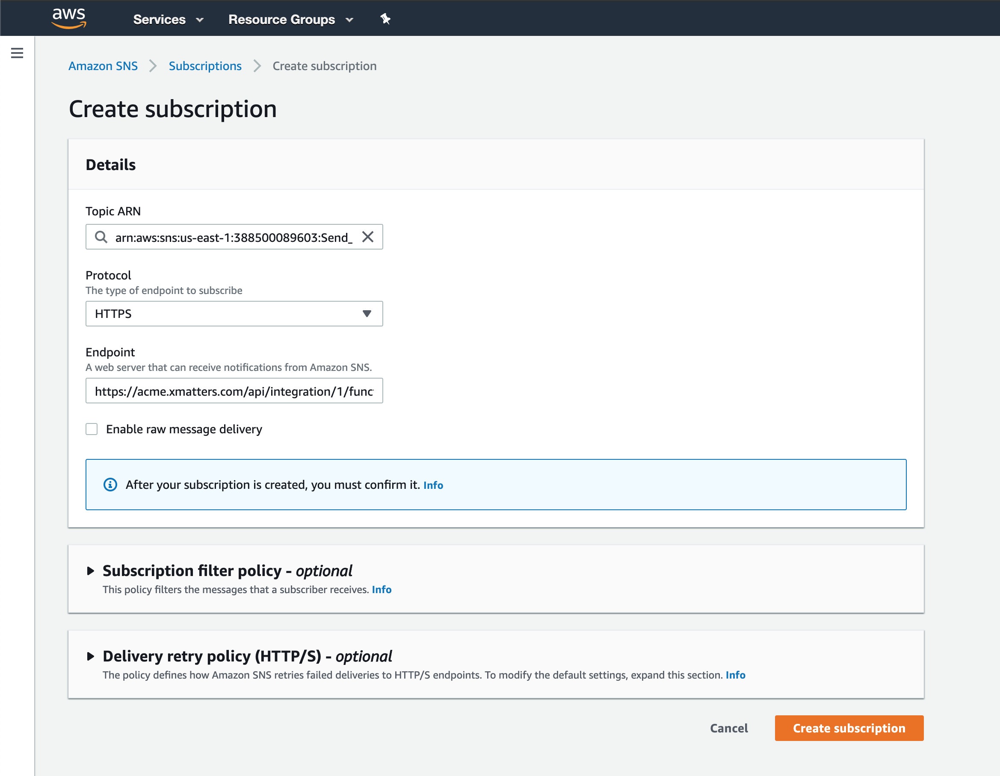

# AWS CloudWatch
  CloudWatch is an Amazon Web Service for monitoring the AWS resources and the customer applications running on the Amazon infrastructure.
  

---------

<kbd>
  
</kbd>

---------

# Prerequisites 
* xMatters account - If you don't have one, [get one!](https://www.xmatters.com/)
* An AWS Account - If you don't have one, [get one!](https://portal.aws.amazon.com/billing/signup#/start)

# Files
* [AWSCloudWatch.zip](AWSCloudWatch.zip) - The Comm Plan containing the forms and integration scripts

# How it works
When a CloudWatch Alarm condition is met, an Simple Notification Service (SNS) message is published and picked up by the SNS subscription. The subscription is tied to a Topic, which generates a webhook to the xMatters inbound integration. 

# Installation

## xMatters

## Import and Configure the xMatters Communication Plan

The next step is to import the communication plan.

To import the communication plan:

1. Login to xMatters as a Developer and create a new user.
1. Create a new REST user. See details [here](https://help.xmatters.com/integrations/xmatters/configuringxmatters.htm#Create)
1. Import the [AWSCloudWatch.zip](AWSCloudWatch.zip) communications plan.
1. Next to the **AWS - CloudWatch** comm plan, click Edit > Access Permissions and give access to the user created in step 2.
1. Click Edit > Forms and next to the **CloudWatch Alarm** form, click Edit > Sender Permissions and give access to the user created in step 2.
1. Click Edit > Layout next to the **Subscription Confirmation** form. Enter **your username** in the Recipients section. (This will be used later to receive the subscription confirmation url.)
1. Navigate to the Flows tab and click on the **CloudWatch Alarm** flow. After the canvas is displayed, double click on the **CloudWatch Alarm - Inbound SNS** step and copy the URL at the bottom:

<kbd>
  
</kbd>

## AWS

### Step 1: Configure an SNS Topic and Subscription

1. Click on the Amazon Simple Notification Service

<kbd>
   
</kbd>

2. Create a topic

<kbd>
   
</kbd>

3. Create a Subscription. 

<kbd>
   
</kbd>

* Make sure the endpoint protocol is https
* Take the ARN from the topic above and paste it into the ARN field
* In the endpoint field, use the url copied from the **Inbound from SNS** HTTP Trigger in the Flow Designer above. 
* Once the subscription is saved, a confirmation will be fired, however, if you don't see an email, the confirmation can be re-triggered by selecting the subscription and clicking the **Request Confirmation**. 

<kbd>
  
</kbd>

5. You will receive a new email from xMatters with the Subscription Confirmation URL

<kbd>
  
</kbd>

6. Click the Subscription URL link and an XML file will be displayed:

<kbd>
  
</kbd>

And the subscription will show a subscription ARN instead of the `PendingConfirmation` and the Status will be updated. The page may need to be refreshed to see the updated status. 

<kbd>
  
</kbd>

### Step 2: Configure an Alarm in CloudWatch

1. Go back to the CloudWatch Console
2. Click on *Alarm*
3. Click on *Create Alarm*
4. Give the alarm a good name and descriptive description
5. Set the "Whenever" information to the criteria you need to monitor. For example, `CPUUtilization > 0.9 for 4 out of 5 datapoints`. 
7. Whenever this alarm: `State is ALARM`
8. Send notification to `Send_to_XM`

<kbd>
   
</kbd>

# Testing

Spike the CPU on an ec2 instance, or otherwise trigger the criteria in the `Whenever` section of the alarm. Then, check the Activity Stream in the **Inbound from SNS** inbound integration. There should be a new entry and a resulting event generated, targeting the recipients set in the form. 

# Troubleshooting

The first place to check is the inbound activity stream. If there is no entry here, the SNS topic failed to fire so investigate the `Whenever` condition and verify the condition was triggered and verify the SNS topic is correctly set up. If there is an entry in the activity stream, but no event, the investigate the activity stream for more details. There will be an error message on why the event wasn't generated. 

If the event was generated but no notification was received, check the recent events report for the event generated to see who was notified. Then verify the correct recipients. 

